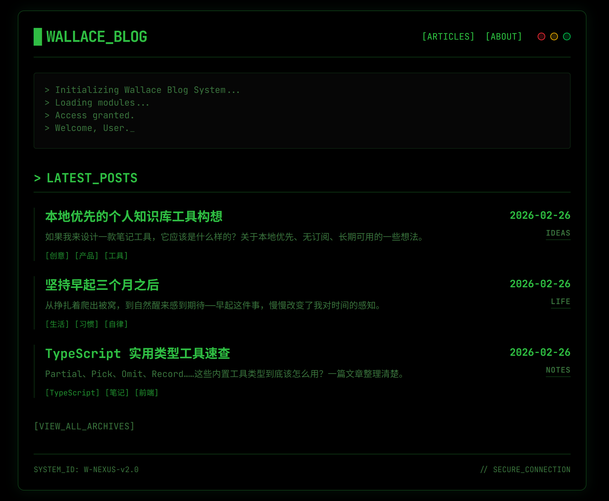

# Wallace Blog Web

[English](#) | [中文](./README.zh-CN.md)

---

## 🚀 About

A modern personal blog platform with a retro-futuristic hacker aesthetic. Built with React 19 and featuring a terminal-inspired design with OLED-friendly dark theme, monospaced typography, and cyberpunk visual elements.



## ✨ Features

- 🎨 **Hacker/Terminal Theme** - Cyberpunk aesthetic with glowing green text and high contrast
- 📝 **Markdown-Based CMS** - File-based content management with frontmatter support
- 🎯 **Category System** - Organize articles by categories (Tech, Life, Ideas, etc.)
- 🔍 **Syntax Highlighting** - Code blocks with highlight.js
- 📱 **Responsive Design** - Mobile-first approach with Tailwind CSS
- ⚡ **Fast Performance** - Built with Vite for lightning-fast development and builds
- 🎭 **Modern Stack** - React 19, TypeScript 5, React Router 7

## 🛠 Tech Stack

- **Frontend**: React 19 + TypeScript 5
- **Routing**: React Router 7 (Data API)
- **Build Tool**: Vite 7
- **Styling**: Tailwind CSS v4 (with `oklch` colors)
- **UI Components**: shadcn/ui + Radix UI
- **Icons**: Lucide React
- **Markdown**: react-markdown + rehype-highlight
- **Date Handling**: date-fns

## 📦 Installation

### Local Development

```bash
# Clone the repository
git clone <repository-url>
cd wallace-blog-web

# Install dependencies
npm install

# Start development server
npm run dev

# Build for production
npm run build

# Preview production build
npm run preview
```

### Docker Deployment

#### 🏗 Step 1: Build Image Locally

```bash
# Build image
docker build -t wallace-blog-web:latest .

# Export image to file
docker save -o wallace-blog-web.tar wallace-blog-web:latest
```

#### 📤 Step 2: Transfer to Server

```bash
scp wallace-blog-web.tar user@your-server:/path/to/deploy/
scp docker-compose.yml user@your-server:/path/to/deploy/
```

#### ⚡ Quick Deploy with Script

Transfer [`deploy.sh`](./deploy.sh) to your server alongside the tar file, then run:

```bash
chmod +x deploy.sh
./deploy.sh
```

The script will automatically load the image, recreate the container, and clean up dangling images.

> **Prerequisite**: `docker-compose.yml` must already exist on the server with the correct volume paths configured.

#### 🚀 Step 3: Deploy on Server

**Method 1: Docker Compose (Recommended)**

```bash
# Load image
docker load -i wallace-blog-web.tar

# Edit docker-compose.yml to update volumes path, then start
docker-compose up -d

# Access: http://localhost:3000
```

**Method 2: Docker CLI**

```bash
# Load image
docker load -i wallace-blog-web.tar

# Run container (replace path with your articles directory)
docker run -d \
  --name wallace-blog \
  -p 3000:80 \
  -v /path/to/your/articles:/usr/share/nginx/html/articles:ro \
  wallace-blog-web:latest

# Linux/Mac example
docker run -d \
  --name wallace-blog \
  -p 3000:80 \
  -v /home/user/articles:/usr/share/nginx/html/articles:ro \
  wallace-blog-web:latest
```

#### 📋 Common Commands

```bash
# View logs
docker logs -f wallace-blog
# or
docker-compose logs -f

# Stop container
docker stop wallace-blog
# or
docker-compose down

# Restart container
docker restart wallace-blog
# or
docker-compose restart

# Remove container
docker rm wallace-blog
```

#### 📁 Article Directory Structure

The mounted article directory must follow this structure:

```
articles/
├── Tech/
│   ├── article-slug-1/
│   │   ├── index.md
│   │   └── cover.jpg (optional)
│   └── article-slug-2/
│       └── index.md
├── Life/
│   └── article-slug-3/
│       └── index.md
└── Ideas/
    └── article-slug-4/
        └── index.md
```

Each article's `index.md` should include frontmatter:

```markdown
---
title: "Article Title"
date: "2024-01-01"
description: "Article description"
tags: ["tag1", "tag2"]
cover: "./cover.jpg"
---

Article content...
```

#### 🔄 Updating Articles

**Editing Existing Articles**

1. Edit the article files directly in the mounted directory
2. Refresh the browser to see updates (no container restart needed)

**Adding New Articles**

1. Create a new article folder in the mounted directory
2. Add an `index.md` file
3. Restart the container to regenerate the index:

   ```bash
   docker-compose restart
   # or
   docker restart wallace-blog
   ```

#### 🔍 Troubleshooting

**Articles Not Showing**

```bash
# 1. Check if the volume is correctly mounted
docker exec wallace-blog ls -la /usr/share/nginx/html/articles

# 2. Check if the index file was generated
docker exec wallace-blog cat /usr/share/nginx/html/articles/index.json

# 3. View container logs
docker logs wallace-blog

# 4. Restart container
docker restart wallace-blog
```

**Permission Issues**

```bash
# Linux/Mac: ensure directory is readable
chmod -R 755 /path/to/articles
```

**Port Conflicts**

```bash
# Use a different port
docker run -d -p 8080:80 ...

# or modify docker-compose.yml
ports:
  - "8080:80"
```

#### 🔐 Security Recommendations

- ✅ Use read-only mounts: always use the `:ro` flag
- ✅ Restrict network access: use firewall rules
- ✅ Update images regularly: keep the base image up to date
- ✅ Back up article content regularly

#### 💾 Backup

```bash
# Backup articles
tar -czf articles-backup-$(date +%Y%m%d).tar.gz /path/to/articles

# Restore articles
tar -xzf articles-backup-20240101.tar.gz -C /path/to/restore/
docker-compose restart
```

#### 🌐 Access URLs

- **Local**: <http://localhost:3000>
- **LAN**: http://YOUR_IP:3000
- **Article Index**: <http://localhost:3000/articles/index.json>

## 📝 Content Management

### Adding New Articles

1. Create a new folder under `src/articles/<Category>/<article-slug>/`
2. Add an `index.md` file with frontmatter:

```markdown
---
title: "Your Article Title"
date: "2024-01-01"
description: "Brief description of your article"
tags: ["tag1", "tag2"]
cover: "./cover.png"
---

Your article content here...
```

1. Add any images to the same folder and reference them in markdown

### Directory Structure

```
src/articles/
├── Tech/           # Technical articles
├── Life/           # Lifestyle posts
├── Ideas/          # Creative ideas
├── Notes/          # Quick notes
├── Products/       # Product reviews
└── Archive/        # Archived content
```

## 🎨 Design System

The project follows a strict "Hacker Terminal" design system:

- **Colors**: OLED black background with terminal green (`#4ADE80`)
- **Typography**: JetBrains Mono (monospace) for all text
- **UI Style**: TUI-inspired with bracket notation `[TAG]`
- **Effects**: Glowing text, subtle scanlines, high contrast

For detailed design guidelines, see [tech_spec.md](./tech_spec.md).

## 📂 Project Structure

```
wallace-blog-web/
├── src/
│   ├── articles/       # Markdown content
│   ├── assets/         # Static assets
│   ├── components/     # React components
│   │   └── ui/         # shadcn/ui components
│   ├── config/         # Configuration files
│   ├── lib/            # Utilities
│   ├── pages/          # Page components
│   └── main.tsx        # Entry point
├── public/             # Public assets
├── tech_spec.md        # Technical specification
└── package.json
```

## 🤝 Contributing

Contributions are welcome! Please ensure your code follows the existing design system and coding standards.

## 📄 License

This project is licensed under the MIT License - see the [LICENSE](./LICENSE) file for details.
